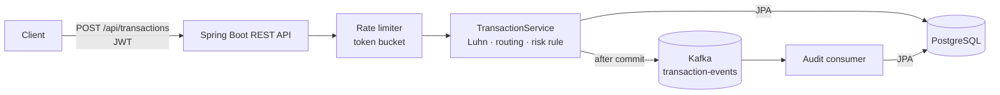

# Real-Time Payment Transaction Switch

[](https://github.com/vednk-shinde/Real-Time-Payment-Transaction-Switch/actions/workflows/ci.yml)


```bash
docker compose up --build     # API on http://localhost:8080 (Postgres + Kafka + app)
```

An event-driven payment transaction switching platform built with Java 17 and Spring Boot 3. It ingests transaction requests over REST, validates and routes them to a (simulated) issuer, persists the result, and publishes every state transition as an immutable event on Kafka for audit and replay.

This is a portfolio/demo project built to exercise the full stack a payments switch touches: REST APIs, JWT-secured endpoints, relational persistence, event streaming, containerization, and a CI/CD pipeline with automated quality gates. It simulates high-volume transaction streams locally — it has not processed real production traffic.

## Architecture



### Request flow (text)

```
                 ┌───────────────┐        ┌────────────────────┐
  Client / cURL  │  REST API      │  JPA   │   PostgreSQL       │
 ───────────────▶│  (Spring Web)  │───────▶│  transactions table │
                 │  + JWT auth    │        └────────────────────┘
                 │  + rate limit  │
                 └──────┬─────────┘
                        │ publishes TransactionEvent
                        ▼
                 ┌───────────────┐
                 │  Kafka topic   │  transaction-events
                 │ (3 partitions) │
                 └──────┬─────────┘
                        │ consumed by
                        ▼
                 ┌───────────────┐
                 │ Event consumer │  audit / downstream projections
                 └───────────────┘
```

Each transaction moves through `RECEIVED → VALIDATED → ROUTED → APPROVED|DECLINED`, and every transition is published as a `TransactionEvent` to Kafka — an append-only, replayable log of switch activity, independent of the synchronous request/response path.

## Why these tools

| Choice | Reason |
|---|---|
| **Kafka** | Every state transition is an immutable event on a partitioned log, so the audit trail is replayable and decoupled from the synchronous request path. |
| **PostgreSQL + JPA** | Payments need ACID guarantees; a unique idempotency key plus `@Version` optimistic locking prevent double-processing under retries and concurrent updates. |
| **Idempotency keys** | Clients retry on timeouts; the switch returns `409` instead of charging twice. |
| **JWT + BCrypt + roles** | Stateless auth fits horizontally scaled instances; `ADMIN` / `OPERATOR` roles separate who can list versus submit. |
| **Token-bucket rate limiting** | Protects ingestion from bursty callers and returns `429` with `Retry-After`. |
| **Publish after commit** | Kafka never carries an event for a rolled-back transaction (the trade-off is covered in the scope notes). |
| **Multi-stage Docker + Compose** | A reviewer runs one command and gets the app plus its dependencies, with no local Java, Kafka or Postgres needed. |

## Tech stack

| Concern | Choice |
|---|---|
| Language / runtime | Java 17 |
| Framework | Spring Boot 3 (Web, Data JPA, Security, Validation, Actuator) |
| Messaging | Apache Kafka (Spring Kafka) |
| Database | PostgreSQL (H2 in-memory for tests) |
| Auth | JWT (jjwt), BCrypt password hashing, role-based access |
| Containers | Docker, multi-stage build, Docker Compose |
| CI/CD | GitHub Actions — JUnit 5, Mockito, JaCoCo coverage, SonarQube static analysis, Docker build & push |
| Build | Maven |

## Key implementation details

- **Idempotency** — every request carries an `idempotencyKey`; a duplicate is rejected with `409 Conflict` instead of being reprocessed, which is what keeps a switch safe under client retries.
- **Event sourcing** — `TransactionEvent` records are published to Kafka on every state change, giving an immutable, replayable audit trail decoupled from the request path.
- **Deterministic routing** — `TransactionRoutingService` resolves an issuer from the card's BIN range; a real switch would resolve this against an issuer directory, but the routing/decision separation is the same shape.
- **Rate limiting** — a per-client token bucket (`RateLimitFilter`) protects the ingestion endpoint from bursty callers. It's in-memory and single-instance; a multi-node deployment would back it with Redis.
- **Security** — stateless JWT auth (`/api/auth/login`) with BCrypt-hashed credentials and role-based authorities (`ROLE_ADMIN`, `ROLE_OPERATOR`).
- **Data integrity** — optimistic locking (`@Version`) on the transaction entity, and masked card numbers (`****1111`) at rest and in every API response.

## Running locally

### With Docker Compose (recommended)

```bash
docker compose up --build
```

This starts PostgreSQL, Zookeeper, Kafka, and the application on `http://localhost:8080`.

### Without Docker

You need a local PostgreSQL and Kafka broker running, then:

```bash
export DB_HOST=localhost DB_PORT=5432 DB_NAME=txswitch DB_USER=txswitch DB_PASSWORD=txswitch
export KAFKA_BOOTSTRAP_SERVERS=localhost:9092
mvn spring-boot:run
```

## Trying the API

The app seeds two demo users on startup: `admin` / `admin123` and `operator` / `operator123`.

**1. Authenticate**

```bash
curl -X POST http://localhost:8080/api/auth/login \
  -H "Content-Type: application/json" \
  -d '{"username":"operator","password":"operator123"}'
```

Copy the `token` from the response.

**2. Submit a transaction**

```bash
curl -X POST http://localhost:8080/api/transactions \
  -H "Authorization: Bearer <token>" \
  -H "Content-Type: application/json" \
  -d '{
        "idempotencyKey": "order-1001",
        "cardNumber": "4111111111111111",
        "merchantId": "MERCHANT-42",
        "acquirerId": "ACQUIRER-7",
        "amount": 150.00,
        "currency": "USD",
        "channel": "ECOMMERCE"
      }'
```

**3. Fetch it back**

```bash
curl http://localhost:8080/api/transactions/<id> -H "Authorization: Bearer <token>"
```

Resubmitting the same `idempotencyKey` returns `409 Conflict`. Amounts over `10000.00` are declined by the demo risk rule in `TransactionService`.

**4. See its audit trail (built by the Kafka consumer)**

```bash
curl http://localhost:8080/api/transactions/<id>/events -H "Authorization: Bearer <token>"
```

## API reference

| Method | Path | Roles | Result |
|---|---|---|---|
| `POST` | `/api/auth/login` | public | `200` `{token, tokenType, expiresInSeconds}`; `401` on bad credentials |
| `POST` | `/api/transactions` | ADMIN, OPERATOR | `201` + `Location` for every processed transaction (approved *or* declined); `400` invalid body; `409` reused idempotency key; `429` rate limited (with `Retry-After`) |
| `GET` | `/api/transactions/{id}` | ADMIN, OPERATOR | `200` transaction; `404` unknown id |
| `GET` | `/api/transactions/{id}/events` | ADMIN, OPERATOR | `200` ordered state transitions as consumed from Kafka |
| `GET` | `/api/transactions?page=0&size=20` | ADMIN | `200` paged list, newest first |
| `GET` | `/actuator/health` | public | liveness/readiness |

### Response codes

| Code | Meaning | When |
|---|---|---|
| `00` | Approved | Valid card, routable BIN, amount within limit |
| `14` | Invalid card number | Luhn checksum fails (declined before routing) |
| `15` | No such issuer | BIN doesn't match any range in the routing table |
| `61` | Exceeds amount limit | Amount > `app.risk.max-amount` (default `10000.00`) |

### Routing table (BIN prefix → simulated issuer)

`4` → Visa · `51–55`, `2221–2720` → Mastercard · `34`, `37` → Amex · `6011`, `65` → Discover

## Tests & quality gates

```bash
mvn clean verify
```

Runs the full JUnit 5 + Mockito suite (unit tests for services, routing, Luhn, JWT and the token bucket; `MockMvc` slice tests for controllers covering 401/403/400/404/409; and an embedded-Kafka integration test that logs in, submits transactions and waits for the audit consumer to record every state transition), then generates a JaCoCo HTML report at `target/site/jacoco/index.html`.

CI (`.github/workflows/ci.yml`) runs on every push/PR to `main`: build, full test suite with coverage, optional SonarQube static analysis (when `SONAR_TOKEN` is configured as a repo secret), a Docker image build, and — on `main` — a push of that image to GitHub Container Registry.

## Project structure

```
src/main/java/com/paymentswitch/
├── config/        Kafka topics, Spring Security, demo data seeding
├── controller/     REST endpoints (auth, transactions)
├── dto/            Request/response records with bean validation
├── exception/      Domain exceptions + a global @RestControllerAdvice
├── kafka/          Event producer/consumer
├── model/          JPA entities and the TransactionEvent payload
├── ratelimit/      Token-bucket rate limiter + servlet filter
├── repository/     Spring Data JPA repositories
├── security/       JWT issuing/validation, auth filter, UserDetailsService
└── service/        Core transaction processing, routing, masking, auth
```

## Honest scope notes

This project is built to demonstrate architecture and engineering practice, not to claim production history:

- Transaction volume is exercised locally, not in production.
- The routing/risk rules are intentionally simple and deterministic so behavior is testable.
- The rate limiter is in-memory and scoped to a single instance.
- Events are published to Kafka *after* the database commit (`TransactionEventRelay`), so Kafka never carries an event for a rolled-back transaction. The flip side: if the process dies between commit and publish, that event is lost from the stream. A transactional outbox table would close that gap.
- Coverage: 68 tests, ~95% JaCoCo instruction coverage as of the last `mvn verify`; the report is generated at `target/site/jacoco/index.html`.

## License

MIT
